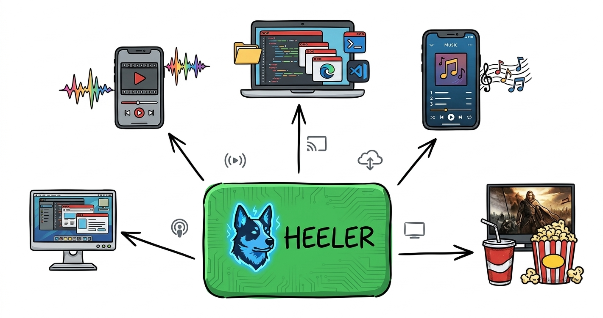

# Heeler

[](https://github.com/ydoc-afk/Heeler/actions/workflows/linux-build-test.yml)
[](https://github.com/ydoc-afk/Heeler/blob/stable/LICENSE)

<p align="center">
  
</p>

<p align="center">
  <b>One Linux box. A whole crew of players. Not a single monitor plugged in.</b>
</p>

**Heeler** is a low-latency game streaming server for [Moonlight](https://moonlight-stream.org/) built to be
*shared*. Every player who connects gets their own freshly spun-up virtual desktop &mdash; any resolution, any refresh
rate, no dummy plugs &mdash; with their games running in isolated Docker/Podman containers. Couch co-op from four
different rooms, a family gaming server in the closet, or a homelab rig that finally earns its power bill: Heeler
herds them all onto one GPU (or several).

## ✨ Highlights

|                                  |                                                                                                                        |
|----------------------------------|------------------------------------------------------------------------------------------------------------------------|
| 🎮 **Multi-user by design**      | Many Moonlight clients stream *different* games from the same hardware, at the same time                               |
| 🖥️ **On-demand desktops**        | A headless Wayland compositor per session: created when you connect, gone when you leave                              |
| 🛋️ **Lobbies**                   | Friends can join a running desktop for co-op, gamepads and pens follow them in and out                                 |
| ⚡ **Low latency**                | Zero-copy H.264 / HEVC / AV1 hardware encoding on NVIDIA, Intel and AMD                                                |
| 🧩 **Multi-GPU**                 | Run and encode each app on its own GPU, or split rendering and encoding across GPUs                                   |
| 🔊 **Surround sound**            | Stereo, 5.1 and 7.1, including Moonlight's high-quality surround mode                                                  |
| 🕹️ **Real input devices**        | Xbox, PlayStation (DualSense with gyro, touchpad and adaptive triggers) and Nintendo pads, pen tablets, touch, hot-plugged mid-game |
| 🐳 **Containers first**          | Games run with low privileges in containers, ready-made images from [Games On Whales](https://github.com/games-on-whales/gow) |
| 🔧 **Hackable**                  | The whole audio/video pipeline is a GStreamer string in `config.toml`: swap encoders or tune parameters without code   |
| 🔌 **Control API**               | A Unix-socket REST API (used by [wolf-ui](https://github.com/games-on-whales/wolf-ui)) for pairing, apps, sessions and health checks |

<p align="center">
  
</p>

## 🚀 What's new in Heeler

Heeler started as a fork of [Wolf](https://github.com/games-on-whales/wolf) and has been busy since:

**Hardened from the network up**
- Dozens of crash and denial-of-service fixes: malformed video parameters, RTSP messages, HTTP requests, control
  packets and API calls can no longer take the server down
- Fresh AES-GCM nonces for every control packet, safer OpenSSL handling, no more arbitrary file reads or URL fetches
  through the API
- Nothing waits forever anymore: stuck pairings, displays that never come up, clients that never ping and stalled
  Docker pulls all time out cleanly
- Starts even when no PulseAudio server is around

**Pairing that doesn't make you dig through logs**
- A PIN page at `http://<host>:47989/pin/` that lists every device waiting to pair, locked behind an admin key
- Get the pairing link pushed to your phone through a webhook (ntfy, Discord, Slack, Home Assistant, ...)
- Optional preset PIN for clients that let you pick one (`moonlight pair <host> --pin 1234`)

**Better streams**
- Moonlight's high-quality 5.1/7.1 surround mode, with a purpose-built Opus encoder
- Each app encodes on the GPU it runs on, with sane fallbacks if that GPU isn't usable
- Configurable forward error correction for lossy Wi-Fi links
- Moonlight shows *why* a launch failed instead of a bare error code
- Pen tablets and touchpads follow players in and out of lobbies

**Friendlier to run**
- Talk to Docker through a socket proxy over TCP instead of mounting the raw Docker socket
- Pull app images from private registries with your Docker `config.json`
- A `/api/v1/health` endpoint for monitoring
- Every setting is a `HEALER_*` environment variable (the old `WOLF_*` names still work)

## 🏁 Get started

Heeler runs as a single container and spins up more containers on demand:

```bash
docker run \
    --name heeler \
    --network=host \
    -v /etc/wolf:/etc/wolf:rw \
    -v /var/run/docker.sock:/var/run/docker.sock:rw \
    --device /dev/dri/ \
    --device /dev/uinput \
    --device /dev/uhid \
    -v /dev/:/dev/:rw \
    -v /run/udev:/run/udev:rw \
    --device-cgroup-rule "c 13:* rmw" \
    -e HEALER_PAIRING_KEY=pick-a-long-random-secret \
    ghcr.io/ydoc-afk/wolf:stable
```

Then pair a Moonlight client:

1. Add your host in Moonlight, it shows a 4-digit PIN
2. Open `http://heeler:47989/pin/` (`heeler` being your server's hostname), unlock it with your `HEALER_PAIRING_KEY`
   (or bookmark `http://heeler:47989/pin/#key=<your key>` to unlock it automatically, it stays open waiting for devices)
3. Type the PIN next to the device that's waiting, and start playing

NVIDIA, Podman and other setups are covered in the
[quickstart](https://games-on-whales.github.io/wolf/stable/user/quickstart.html). Prebuilt apps (Steam, Pegasus,
PrismLauncher, Firefox, ...) come from [games-on-whales/gow](https://github.com/games-on-whales/gow).

## ⚙️ Handy settings

| Variable                  | What it does                                                                                   |
|---------------------------|------------------------------------------------------------------------------------------------|
| `HEALER_PAIRING_KEY`      | Admin key for the PIN page (without it, only the one-time link in the log works)               |
| `HEALER_PAIRING_WEBHOOK`  | URL that gets the PIN page link whenever a device starts pairing                               |
| `HEALER_PAIRING_PIN`      | Fixed 4-digit PIN for clients that let you choose one; rate limited, meant for temporary use   |
| `HEALER_RENDER_NODE`      | Default GPU (`/dev/dri/renderD128`); apps can pick their own with `render_node` in `config.toml` |
| `HEALER_FEC_PERCENTAGE`   | Extra error correction for lossy networks (default `20`)                                       |
| `HEALER_DOCKER_SOCKET`    | Docker/Podman socket path, or `tcp://proxy:2375` for a socket proxy                            |
| `HEALER_DOCKER_CONFIG`    | Docker `config.json` with credentials for private registries                                   |
| `HEALER_LOG_LEVEL`        | `ERROR`, `WARNING`, `INFO`, `DEBUG` or `TRACE`                                                 |

The full list, and everything `config.toml` can do, is in the
[configuration guide](docs/modules/user/pages/configuration.adoc).

## 📚 Documentation

Heeler's documentation currently lives with the original project:

- [User guide](https://games-on-whales.github.io/wolf/stable/): quickstart, configuration, wolf-ui, troubleshooting
- [How it works](https://games-on-whales.github.io/wolf/stable/dev/how-it-works.html): the architecture, building from
  source, the control API
- [Protocol documentation](https://games-on-whales.github.io/wolf/stable/protocols/index.html): the Moonlight
  protocol as implemented (pairing, RTSP, RTP, control)
- [FAQ](https://games-on-whales.github.io/wolf/stable/faq.html)

Heeler is a specific tool for a specific job. Looking for a general purpose, single-user streaming host?
[Sunshine](https://github.com/LizardByte/Sunshine) is great at that.

## 🙏 Acknowledgements

Heeler stands on the shoulders of [Wolf](https://github.com/games-on-whales/wolf) &mdash; huge thanks to
[abeltra](https://github.com/abeltra) and everyone who built the original project.

- [@Drakulix](https://github.com/Drakulix) for the incredible help given in developing Wolf
- [@zb140](https://github.com/zb140), [@JBailes](https://github.com/JBailes) and [@salty2011](https://github.com/salty2011) for the constant help and support in [GOW](https://github.com/games-on-whales/gow)
- [@loki-47-6F-64](https://github.com/loki-47-6F-64) for creating and sharing [Sunshine](https://github.com/loki-47-6F-64/sunshine)
- [@ReenigneArcher](https://github.com/ReenigneArcher) for being the first stargazer of the project and keeping
  [Sunshine alive](https://github.com/LizardByte/Sunshine)
- Everyone in the [Moonlight](https://moonlight-stream.org/) community, for the tireless help they give to anyone
